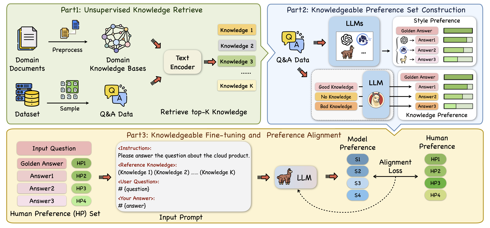

# Knowledgeable Preference Alignment for LLMs in Domain-specific Question Answering

[](https://github.com/zjukg/KnowPAT/main/LICENSE)
[](https://arxiv.org/abs/2311.06503)
[](https://pytorch.org/)
 - [Knowledgeable Preference Alignment for LLMs in Domain-specific Question Answering](https://arxiv.org/abs/2311.06503)

> Recently, the development of large language models (LLMs) has attracted wide attention in academia and industry. Deploying LLMs to real scenarios is one of the key directions in the current Internet industry. In this paper, we present a novel pipeline to apply LLMs for domain-specific question answering (QA)  that incorporates domain knowledge graphs (KGs), addressing an important direction of LLM application. As a real-world application, the content generated by LLMs should be user-friendly to serve the customers. Additionally, the model needs to utilize domain knowledge properly to generate reliable answers. These two issues are the two major difficulties in the LLM application as vanilla fine-tuning can not adequately address them. We think both requirements can be unified as the model \textbf{preference} problem that needs to align with humans to achieve practical application. Thus, we introduce Knowledgeable Preference AlignmenT (KnowPAT), which constructs two kinds of preference set called style preference set and knowledge preference set respectively to tackle the two issues.  Besides, we design a new alignment objective to align the LLM preference with human preference, aiming to train a better LLM for real-scenario domain-specific QA to generate reliable and user-friendly answers. Adequate experiments and comprehensive with 15 baseline methods demonstrate that our KnowPAT is an outperforming pipeline for real-scenario domain-specific QA with LLMs.

## 🌈 Model Architecture


## 💻 Data preparation
For reasons of **commercial confidentiality**, the dataset in our paper will **not** be made public. However, we provide examples of the data in `data/` so that you can construct your own preference dataset and try out our alignment method according to the given format.

For each data instance, you should prepare a question and several answers, and the human preference score of each answer. A higher score means a better and preferred answer. Note that the answers should be sorted in the **score descending** order, which means the better answer and its score should be in the front.


## 🔬 Dependencies
Our code is developed based on [RRHF](https://github.com/GanjinZero/RRHF). Please build the Python environment following the instruction like RRHF.

To set up, you can use the following command lines to set up python3.8 and pytorch requirements:

```shell
conda create -n alignment python=3.8
pip install torch==1.13.0+cu116 torchvision==0.14.0+cu116 torchaudio==0.13.0 --extra-index-url https://download.pytorch.org/whl/cu116

```
Install other packages:

```shell
pip install -r requirements.txt
```

## 📕 Training & Test

- run KnowPAT tuning
```shell
export MODEL_PATH="YOUR LLM PATH"
export SAVE_PATH="YOUR SAVE PATH"
export DATA_PATH="YOUR DATA PATH"
export WANDB_DISABLED=true
wandb offline

CUDA_VISIBLE_DEVICES=0 nohup python train.py \
    --model_name_or_path $MODEL_PATH \
    --data_path $DATA_PATH \
    --bf16 True \
    --output_dir $SAVE_PATH \
    --num_train_epochs 3 \
    --per_device_train_batch_size 1 \
    --per_device_eval_batch_size 1 \
    --gradient_accumulation_steps 8 \
    --evaluation_strategy "no" \
    --save_strategy "steps" \
    --save_steps 3000 \
    --save_total_limit 40 \
    --learning_rate 3e-4 \
    --weight_decay 0. \
    --warmup_ratio 0.03 \
    --lr_scheduler_type "cosine" \
    --logging_steps 1 \
    --model_max_length 512 --rrhf_weight 0.1 > log.txt &

```
You may need to fill your model/save/data path before running. The model path should be a llama-architecture LLM.

- run inference
```shell
CUDA_VISIBLE_DEVICES=0 python inference.py
```


## 🤝 Cite:
Please consider citing this paper if you use the code from our work.
Thanks a lot :)

```bigquery

@article{DBLP:journals/corr/abs-2311-06503,
  author       = {Yichi Zhang and
                  Zhuo Chen and
                  Yin Fang and
                  Lei Cheng and
                  Yanxi Lu and
                  Fangming Li and
                  Wen Zhang and
                  Huajun Chen},
  title        = {Knowledgeable Preference Alignment for LLMs in Domain-specific Question
                  Answering},
  journal      = {CoRR},
  volume       = {abs/2311.06503},
  year         = {2023}
}

```
